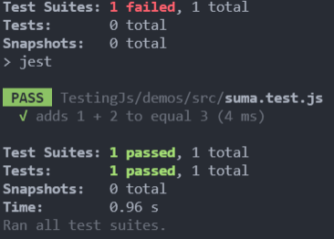

# TESTING JS


# Que es el Testing en Javascript

En el mundo actual las tecnologias con las que vivimos necesitan codigo, esto ha hecho que el desarrollo de software se haya vuelto industrial, donde contamos con procesos y herramientas, como el testing, que nos permiten entregar mas rapido proyectos de calidad a nuestros clientes reduciendo el riesgo de errores en produccion.

## ¿Por que hacer testing?

Normalmente hay cuatro fases en el desarrollo de software para crear un producto:

**Diseño ⇒ Desarrollo ⇒ Pruebas ⇒ Produccion**

En estas fases, detectar un error se vuelve cada vez mas costoso. Ahi es donde hacemos tecnicas para prevenir estas situaciones. El testing es la manera en la que nosotros gestionamos el riesgo y tratamos de evitar, en la medida de lo posible, los errores en el sistema.

## Gestionar riesgos como Google

1. **Analisis de codigo estatico**: Mientras desarrollamos vamos viendo nuestros resultados.
2. **Pruebas unitarias**: Nos aseguramos que el codigo funciona como queremos.
3. **Pruebas de integracion**: Verificar que varios elementos funcionan bien trabajando juntos.
4. **Revision de codigo**: Equipo o persona encargada de revisar el codigo de las demas personas.
5. **QA**: Equipos de creacion de pruebas automaticas o manuales.

**Lo importante con el testing es reducir los riesgo**

# La piramide de testing

La pirámide clásica del testing: (de menos a más costoso y tendría que haber más pruebas de las primeras que de las últimas)

- unit tests: se corren directamente al codigo
- integration tests: probamos dos funcionalidad
- end to end tests (e2e) : son las pruebas de punto a punto
- ui test: emulan el dispositivo físico : emulanos los sistemas de cada uno

En javascript se recomienda en vez la pirámide el trofeo de tests:

- static tests: el tronco (el segundo mayor número de pruebas)
- unit tests: mismo num. de pruebas que e2e y menos que static e integration
- integration tests: el mayor número de pruebas debe ser aquí
- e2e tests: mismo tamaño que unit tests y menos que static e integration

# Deuda Técnica

Igual que en las finanzas, las deudas no son buenas ni malas, solo son una estrategia para alcanzar algo y luego se paga.

Haciendo pruebas se maneja el riesgo

- Diseño
- Desarrollo
- Pruebas
- Producción

El momento y pruebas dependen de la fase en la que se encuentra la compañía

1. Tracción : lanza y no importa mucho el testing
2. Inflexión : llenamos sistemas de monitoreo, con las pruebas
3. Escala :
4. Expansión

La deuda de deficiencia del desarrollador puede ser alta porque en la fase de tracción, la compañía busca velocidad > precisión , de modo que en esta etapa el testing no se valora, ya que buscan lanzar, lanzar, lanzar…

Cuando se entra a la fase de inflexión, hay más usuarios y se empiezan a escribir más pruebas, curando la deuda.


# Herramientas de Testing

Estas herramientas mencionadas están clasificadas según el tipo o nivel de pruebas a realizar.

- **Multipropósito o Robustas**
Pueden ejecutar la mayoría de pruebas de la pirámide o trofeo, tanto para backend, frontend, integration test, algunas hasta UI y API s testing.
Jest, _Chai, Mocha, Ava, Jasmine _

 - **UI Testing**
Pruebas desplegadas en un dispositivo real o simulado bajo un Browser (navegador) automatizando toques y gestos en la aplicación.
Playwright, _ Cypress, WebdriverIO, Puppeteer_

- **API Testing**
En general, las APIs no tienen UI, usan protocolos de servicios por peticiones.
Supertest, Dredd, Postman

 - **Pruebas Estáticas**
Estas pruebas no ejecutan el código, estas herramientas se integran al editor de código y van analizando si hay alguna mala práctica.
ESLint, Prettier, Typescript tools (TSLint)

*Todas estas herramientas manejan una sola estructura (de forma), de modo que el lenguaje o framework pasa a un segundo plano.
## Grafica del rankings en testing


- Puedes revisarel ranking a traves del siguinete link [Ranking Testing](https://2021.stateofjs.com/en-US/libraries/testing/)

### **Pruebas TESTING entee JEST y  JASMINE**

**JASMINE TEST**

```javascript
describe("a suite is just a function", ( )=>{
    const a;
    it("and so is a spec", ()=>{
        a=true;
        expect(a.toBe(true));
    });
});
```

```javascript
it('null',()=>{
    const n=null;
    expect(n).toBeNull();
    expect(n).toBeDefiend();
    expect(n).not.toBeUndefiend();
    expect(n).not.toBeTruthy();
    expect(n).toBeFalsy();
});
```
**JEST**
```javascript
describe("a suite is just a function", ( )=>{
    const a;
    test("and so is a spec", ()=>{
        a=true;
        expect(a.toBe(true));
    });
});
```
```javascript
test('null',()=>{
    const n=null;
    expect(n).toBeNull();
    expect(n).toBeDefiend();
    expect(n).not.toBeUndefiend();
    expect(n).not.toBeTruthy();
    expect(n).toBeFalsy();
});
```

** Como se ve claramente en ambos testing utilizan la misma estructura solo cambia el nombre de ***test*** y ***it***


# Realizando testing con JEST

Para realizar una prueba dentro de un ambiente se requiere primero instalar **node.js** y e intalar jest con el siguinete comando
`````
npm install --save-dev jest
`````
 Al instalar el paquete de jest podemos realizar los pruebas que nostoros requerimos creando archivos como **file.test.js** y tener otroi archivo donde esta nuestro codigo que va requerir probar.

**CODIGO**
```javascript
function sum(a, b) {
    return a + b;
}
module.exports = sum;
```
**PRUEBA DE CODIGO**

```Javascript
const sum = require('./suma');

test('adds 1 + 2 to equal 3', () => {
    expect(sum(1, 2)).toBe(3);
});
```
dicho lo anterior se debe probar en terminar y teniendo la configuracion en nuestro **package.json**
 ```json
 "scripts": {
        "test": "jest"
    },
 ```
 y ejeuctar el siguiente comando
```
npm run test
```

dandonos como resultado en nuestro terminal



## Segundo ejercicio de Testing

Para el siguinete ejemplo se debe crear un archivo donde contenga el siguinete codigo

```javascript
function suma(a, b) {
    return a + b;
}

function multipli(a, b) {
    return a * b;
}

function divide(a, b) {
    return a / b;
}

module.exports = {
    suma,
    multipli,
    divide
};
```
despues agregar otro archivo en donde se creo el antiguo archivo llamandolo con la extencion **.test.js** y dentro de este archivo se debe agregar el siguiente codigo

```javascript
const { suma, multipli, divide } = require('./math.js');

test("Se coloca el mensaje como ejemplo adds 1 + 3 slould be 4", () => {
    const resulta = suma(1, 3);
    expect(resulta).toBe(4)
})
```
al tener ambos archivos se debe ejecutar el comando **npm run test** a.
